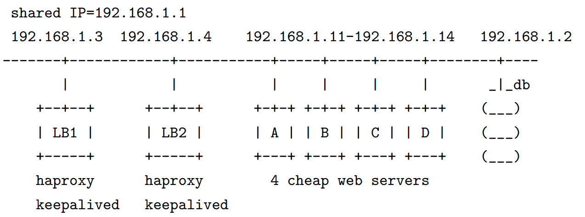
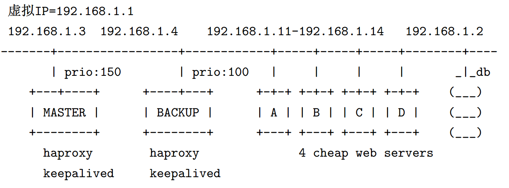
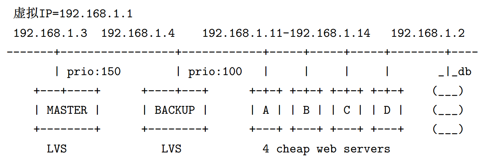

# Keepalived 权威指南

> Keepalived-Definitive-Guide-cn.pdf [下载](https://github.com/hello-world-example/Keepalived/raw/master/docs/Definitive-Guide/Keepalived-Definitive-Guide-cn.pdf)
>
> - ŠFinal BSD ( Kevin Kuang ) 2009-03


## 1 VRRP

Keepalived 是 VRRP 的完美实现，因此在介绍 Keepalived 之前，我们有必要先了解 VRRP 的原理。了解VRRP最好的文档莫过于 VRRP 的 [RFC3768](http://www.faqs.org/rfcs/rfc3768.html)文档

### 1.1 VRRP 协议简介

在现实的网络环境中（比如Internet），两台需要通信的主机（end-host）大多数情况下并没有直接的物理连接。对于这样的情况，它们之间的路由怎么选择？主机如何选定到达目的主机的下一跳路由，这是一个问题。通常的解决办法有两种：

- 在主机上使用动态路由协议（比如RIP，OSPF等）
- 在主机上配置静态路由

很明显，在主机上配置动态路由协议是非常不切实际的，因为管理、 维护成本以及是否支持等诸多问题。那么配置静态路由就变得十分的流行。实际上，这种方式我们至今一直在用。但是，路由器（或者说默认网关 default gateway）却经常成为单点。就算配置了多个静态路由，却因为必须重启网络才能生效而变得不实用。

**VRRP的目的就是为了解决静态路由单点故障问题！**

VRRP通过一种竞选（election）协议来动态的将路由任务交给 LAN 中虚拟路由器中的某台 VRRP 路由器。这里看起来很绕，因为有两个关键名词：虚拟路由器 和 VRRP路由器。


#### VRRP 路由器

VRRP 路由器就是一台路由器，只不过上面运行了 VRRPD 这样的程序来实现 VRRP 协议而己，这是物理的路由器。一台 VRRP 路由器可以位于多个虚拟路由器。


#### VRRP 虚拟路由器

所谓虚拟，就是说并不是实际存在的，是一个逻辑而不是物理的路由器。虚拟路由器通常由多台(物理的) VRRP路由器通过某种方式组成，就好比这些物理的路由器都丢到一个池(pool)里面去，整个 pool 对外看起来就象是一台路由器，但其实内部有多台。**虚拟路由器的标识称为 VRID**。


#### MASTER 和 BACKUP

在一个 VRRP虚拟路由器中，有多台物理的 VRRP路由器，但是这多台物理的机器并不同时工作 ,而是由一台称为MASTER 的负责路由工作，其他的都是BACKUP。MASTER 并非一成不变，VRRP协议让每个VRRP路由器参与竞选，最终获胜的就是 MASTER。MASTER 有一些特权，**比如 拥有虚拟路由器的IP地址**，我们的主机就是用这个IP地址作为静态路由的。**拥有特权的 MASTER 要负责转发发送给网关地址的包和响应 ARP请求**。

### 1.2 工作机制

VRRP通过竞选协议来实现虚拟路由器的功能。所有的协议报文都是通过IP多播(multicast)包 (多播地址224.0.0.18)形式发送的。虚拟路由器由 **VRID(范围0-255)**和一组IP地址组成，对外表现为一个周知的MAC地 址： **00-00-5E-00-01-{VRID}** 。所以，在**一个虚拟路由器中，不管谁是MASTER，对外都是相同的 MAC 和 IP (称之为VIP)**。**客户端主机并不需要因为 MASTER 的改变而修改自己的路由配置，对他们来说，这种主从的切换是透明的**。

在一个虚拟路由器中，只有作为 MASTER 的 VRRP 路由器会一直发送 VRRP 广告包(VRRP Advertisement message)， BACKUP不会抢占MASTER， 除非它的优先级(priority)更高。当 MASTER 不可用时(BACKUP收不到广 告包〉，多台 BACKUP 中优先级最高的这台会被抢占为MASTER。这种**抢占是非常快速的(<1s)**，以保证服务的连续性。

出于安全性考虑，VRRP包使用了加密协议进行加密。

## 2 Keepalived

Keepalived的设计和实现虽然简单，但是配置也有不少，本章主要就阐述这些。

### 2.1 Keepalived 的设计和实现

Keepalived 是一个高度模块化设计的软件，源代码的结构似乎也很容易看出这一点，里面只有

- check
- core
- libipfwc
- libipvs-2.4
- libipvs-2.6
- vrrp

这么一些目录。


- **core** Keepalived 的核心程序，比如全局配置的解析，进程启动等等;
- **vrrp** Keepalived的 vrrpd 子进程以及相关的代码
- **check** keepalived 的 healthchecker子进程的目录，包括了所有的健康检查方式以及对应的配置的解析，LVS的配置解析也在这个里面
- **libipfwc** iptables(ipchains)库，主要用来配置 LVS 中的 firewall-mark
- **libipvs\*** 也是使用**LVS**需要用到的。


#### 2.1.1 多进程模式

keepalived采用了多进程的设计模式，每个进程负责不同的功能，我们在使用 LVS 的机器上通常可以看到这样的进程：

- 111 Keepalived < 父进程：内存管理，监控子进程
- 112 \\_ Keepalived < VRRP子进程
- 113 \\_ Keepalived < healthchecker子进程

有些命令行参数来控制不开启某些进程，比如不运行 LVS 的机器上，

- 只开启 VRRP就可以了(-P)
- 如果只运行healthchecker 子进程，使用-C。


#### 2.1.2 控制面板

所谓的控制面板就是对配置文件的编译和解析，**Keepalived 的配置文件解析比较另类，并不是一次统统解析所有的配置，只在用到某模块的时候才解析相应的配置**，在每个模块里面都可以看到 XXX_parser.c 这样的文件，就是做这个作用的。


#### 2.1.3 WatchDog

这种框架提供了对子进程( VRRP 和 healthdiecker )的监控。


#### 2.1.4 IPVS 封装

Keepalived里面所有对 LVS 的相关操作并不直接使用 ipvsadm 这样的用户端程序，而是直接使用 IPVS 提供的函数进程操作，这些代码都 在 check/ipwrapper.c 中。


### 2.2 Keepalived 的安装

安装 Keepalived 和安装其他开源软件一样，非常的简单，**configure**，**make**，**make install** 就可以搞定，但是我们还是需要简单的说明一下这个操作过程：

```bash
./configure --prefix=/ \
--mandir=/usr/local/share/man \
--with-kernel-dir=/usr/src/kernels/2.6.9-67.EL-smp-i686/ 

make
make install
```

说明如下：

- prefix 这个指定为 / 吧，这样配置文件会放到目录下，方便操作

- mandir 这个也放到 Linux 系统默认的man目录下，方便査看

- with-kernel-dir 这是个重要的参数，这个参数并不表示我们要把 Keepalived 编进内核，而是指使用内核源码里面的头文件，也就是 include 目录

  - > 如果要使用 LVS，才需要这样指定，否则不需要，而且如果要使用 netlink，还需要 link_watch.c 这个文件


在confiure正确的执行后，可以得到下面的输出：

```bash
Keepalived configuration
------------------------
Keepalived version       : 1.1.15
Compiler                 : gcc
Compiler flags           : -g -O2
Extra Lib                : -lpopt -lssl -lcrypto
Use IPVS Framework       : Yes
IPVS sync daemon support : Yes
Use VRRP Framework       : Yes
Use LinkWatch            : Yes
Use Debug flags          : No
```

#### 注意

- **Use IPVS Framework** IPVS 框架一也即 LVS 的核心代码框架，如果不使用LVS，可以在 configure 时指定参数`disable-lvs`，这样的话，这里看到的就是 No 而不是 Yes。

- **IPVS sync daemon support** IPVS 同步进程，很显然，如果前面那项 是No的话，那么这里肯定也是 No，当然如果前面这项是 Yes，即使 用LVS，而不想使用 LVS 的同步进程(sync daemon)，可以在configure的时候指定 `disable-lvs-syncd`
- **Use VRRP Framework** VRRP框架，这基本上是必须的，Keepalived的核心进程 vrrpd
- **Use LinkWatch** 所谓的 Linkwatch 大概意思是通过接收内核发出的关于网卡的状态信息来判断网卡的状态，因为是内核发出的信息，这样在用户端只需要捕捉这些信息即可，相比直接在用户端通过其他方式来实现看起来会更省资源，Keepalived 在网卡超过20块的情况下推荐使用。

简而言之，如果不使用LVS功能，那么只要看到 *Use VRRP Framework* 为 *No* 就可以，反之，必须有 *Use VRRP Framework* 为 *Yes*，其他都是 optional 的。


安装基本就这么简单，但是你可能还有疑问，到底在哪里下载 Keepalived ? 直接到Keepalived的官网下吧：[www.keepalived.org](http://www.keepalived.org)


### 2.3 KeepAlived 配置详解

Keepalived 的所有配置都在一个配置文件里面设置，支持的配置项也比较多。但分为三类：

- 全局配置(Global Configuration) 
- VRRPD 配置
- LVS配置

很明显，全局配置就是对整个 keepalived 起效的配置，不管是否使用 LVS。VRRPD 是 keepalived 的核心，LVS 配置只在要使用 keepalived 来配置和管理LVS时需要使用，如果仅使用 keepalived 来做 HA， LVS的配置完全是不需要的。

配置文件都是以块(block)形式组织的，每个块都在 `{` 和 `}` 包围的范围内。`#` 和 `!` 开头的行都是注释。


#### 2.3.1全局配置

全局配置包括两个子配置，即所谓的：**全局定义(global definition)** 和 **静态地址路由(static ipaddress/routes)**


##### 全局定义

全局定义主要设置keepalived的通知机制和标识：

```
global_defs
{
	notification_email
	{
		admin@example.com
	}
	
	notification_email_from admin@example.com
	smtp_server 127.0.0.1
	stmp_connect_timeout 30
	router_id my_hostname
}
```


- `notification_email` 指定 keepalived 在发生事件(比如切换)时，需要发送 `email` 到的对象，可以有多个，每行一个
- `smtp_*` 指定发送 email 的 smtp 服务器，如果本地开启了sendmail的话， 可以使用上面的默认配置
- `route_id` 运行 keepalived的机器的一个标识


##### 静态地址和路由

所谓 静态(static) 就是说不会随 vrrpd instance 的 开/关 而变化的，VIP就不是static的，会随着vrrpd而添加/删除。这个配置可以用来给服务器配置静态的IP地址/路由，当然如果服务器的配置里面已经有这些配置，这里就不需要设置了。

```
static_ipaddress
{
    192.168.1.1/24 brd + dev eth0 scope global
    ...
}

static_routes
{
    src $SRC_IP to $DST_IP dev $SRC_DEVICE
    ...
    src $SRC_IP to $DST_IP via $GW dev $SRC_DEVICE
}
```


每一行设置一个IP，这些配置都是 Linux 下中这个命令的参数，比如上 面的 `192.168.1.1/24 brd + dev eth0 scope global`， keepalived 最终会直接使用 `ip addr add 192.168.1.1/24 brd + dev eth0 scope global` 来添加，所以这里的配置都要符合 ip 命令的规则。

这就是全局配置段的全部。


#### 2.3.2 VRRPD 配置

VRRPD 的配置也包括2部分：VRRP 同步组(synchroizationgroup) 和 VRRP实例(VRRP Instance)。

##### VRRP Sync Groups(s)

不使用 Sync Group 的话，如果机器(或者说router)有两个网段，一个内网一个外网，每个网段开启一个VRRP实例，假设 VRRP 配置为检查内网，那么当外网出现问题时，VRRPD 认为自己仍然健康，那么不会发送 Master 和Backup 的切换，从而导致了问题。Sync group 就是为了解决这个问题，可以把两个实例都放进一个 Sync Group，这样的话，group 里面任何一个实例出现问题都会发生切换。

```
vrrp_sync_group VG_1 {
  group {
    inside_network 			# 这里是实例名(比如 VI_1)
    outside_network
    ...
  }
  notify_master /path/to/to_master.sh
  notify_backup /path_to/to_backup.sh
  notify_fault "/path/fault.sh VG_1"
  notify /path/to/notify.sh
  smtp_alert
}
```


- notify_master 指定当切换到 Master 时，执行的脚本，这个脚本可以传入参数（引号引起），其他2个类推
- notify 指令有 3个参数，这些参数由 keepalived 提供：
  - `$1(GROUP—INSTANCE)`
  - `$2(group 或者 instance 的名称)`
  - `$3(MASTER—BACKUP—FAULT)`

- smtp_alter 使用 `global_defs` 里面定义的邮件地址和 smtp 服务器在切换后发送邮件通知

  

##### VRRP 实例（instance）配置

VRRP 实例就表示在上面开启了 VRRP 协议，这个实例说明了 VRRP 的 一些特性，比如主从、VRID等等，可以在每个 interface 上开启一个实 例。VRRP 实例配置主要定义 `vrrp_sync_group` 里面的每个组的漂移IP等。

```bash
vrrp_instance inside_network {
  # 初始状态
  state MASTER
  interface eth0
  dont_track_primary
  
  track_interface {
    eth0
    eth1
  }
  
  mcast_src_ip <IPADDR>
  garp_master_delay 10
  virtual_router_id 51
  # 优先级
  priority 100
  advert_int 1
  
  authentication {
    auth_type PASS
    autp_pass 1234
  }
  
  virtual_ipaddress {
    #<IPADDR>/<MASK> brd <IPADDR> dev <STRING> scope <SCOPT> label <LABEL>
    192.168.200.17/24 dev eth1
    192.168.200.18/24 dev eth2 label eth2:1
  }
  
  virtual_routes {
    # src <IPADDR> [to] <IPADDR>/<MASK> via|gw <IPADDR> dev <STRING> scop
    src 192.168.100.1 to 192.168.109.0/24 via 192.168.200.254 dev eth1
    192.168.110.0/24 via 192.168.200.254 dev eth1
    192.168.111.0/24 dev eth2
    192.168.112.0/24 via 192.168.100.254
  }
  
  nopreempt
  preemtp_delay 300
  debug
}
```


- **state** ：state 指定 instance 的**初始(Initial)状态**，在两台 router 都启动后，马上会发生竞选，高 priority 的会竞选为 Master，所以这里的 state 并不表示这台就一直是 Master

- **interface** ：inside_network 实例绑定的网卡

- **dont_track_primary** ：忽略 VRRP 的 interface 错误 ( 默认不设置 )

- **track_interface** ：设置额外的监控，里面的任意一个网卡出现问题，都会进入 **FAULT** 状态

- **mcast_src_ip** ：发送多播包的地址，如果不设置，默认使用绑定的网卡的 primary  IP

- **garp_master_delay** ：在切换到 **MASTER** 状态后，延迟进行gratuitous ARP 请 求 

- **virtua_router_id** ：VRID 标记 (0... 255)

- **priority 100** ：高优先级竞选为 MASTER， **MASTER 要高于 BACKUP 至少 50**

- **advert_int** ：检査间隔，默认 1s

- **virtual_ipaddress** ：里面指定漂移地址(VIP)，也就是切换到MASTER时， 这些IP会被添加，切换到 BACKUP时，这些IP被删除(传给ip addr 命令)，所以每台服务器上可以不绑定任何虚拟地址，而都把他们放 `virtual_ipaddress` 里面(可以多个)，keepalived 会自动使用 ip addr 进行绑定(不需要以来 ifcfg-eth0)，`ip add` 可以看到

- **virtual_routes** 和 **virtual_ipaddress** —样，发生切换时添加/删除路由

- **lvs_sync_daemon_interface** ：lvs syncd 绑定的网卡

- **authentication** ：这一段设置认证 **auth_type** 认证方式，支持 **PASS** 和 **AH **

- **auth_pass** ：认证的密码

- **nopreempt** ：设置为不抢占，注意这个配置只能设置在 state 为 BACKUP 的主机上，而且这个主机的priority 必须比另外一台高

- **preempt_delay**： 抢占延迟，默认5分钟

- **debug**： Debug级别

- **notify_master** 和 **sync group** 里面的配置一样

  

#### 2.3.3 LVS 配置 TODO

LVS 的配置也包括2部分：虚拟主机组(virtual server group) 和 虚拟主机(virtual server)。这些配置都会传递给ipvsadm 作为参数。

##### 虚拟主机组

这个配置段是可选的，目的是为了让一台 RealServer 上的某个 service 可以属于多个 Virtual Server，并且只做一次健康检査。

```bash
virtual_server_group <STRING> {
  # VIP port
  <IPADDR> <PORT>
  <IPADDR> <PORT>
  ...
  fwmark <INT>
}
```


##### 虚拟主机

virtual_server 可以以一下 3种 方式中的任意一种配置：

- virtual server IP port
- virtual server fwmark int
- virtual server group string

如下例：

```

```


## 3 应用实例

本章主要介绍两种 Keepalived 的使用，一种仅使用 Keepalived 做 HA，一种既做 HA 又用来配置 LVS。

### 3.1 用 Keepalived 做HA

用 Keepalived 做 HA 是如此的简单，我们所有的精力都在配置 Keepalived 的 VRRP 子进程上，而完全可以不管LVS 的配置。这节我们假设给两台运行 HAProxy 的机器做 HA，提供 VIP。架构如下：




#### 3.1.1 HAProxy 和 web 服务器配置

这部分不属于本文讨论范围内，我们只关注在 haproxy 的机器上的 Keepalived 相关配置。


#### 3.1.2 Keepalived 配置

假设 haporxy 和后端的web服务器都准备好了，现在就可以开始配置 Keepalived了 。这种情况下，因为我们只用到 Keepalived 的 HA，即做 virtual router的功能，所以只需要完成第二章里面描述的 全局和VRRP配置即可。 配置前需要准备的信息为：

- VRID —— 我们使用默认的 51
- VIP —— 上图的 192.168.1.1，VIP 也即 Keepalived 里面的 vritualaddress 的 IP 地址
- LB 的 IP —— 这里就是两台 haproxy 的地址（192.168.1.3和1.4，并假设前者为 MASTER ）
- 优先级 —— priority，在多个 BACKUP 竞选 MASTER 的时候，优先级高会获选。这里假设 192.168.1.3 的优先级为150，另外一台为 100

所以，实际要配置为：




##### 不抢占

当 MASTER 出现问题后，BACKUP 会竞选为新的 MASTER ，那么当之前的 MASTER 重新 ONLINE 后，是继续成为 MASTER 还是变成 BACKUP 呢？

默认情况下，如果没设置不抢占，那么之前的 MASTER 起来后会继续抢占成为MASTER，也就是说，整个过程需要发生 2次切换：

- MASTER->BACKUP
- BACKUP->MASTER

这样对业务频繁的切换是不能容忍的，因此我们希望 MASTER 起来后， 成为 BACKUP。所以要设置不抢占。

Keepalived里面提供了**nopreempt** 这个配置，但是这个配置只能用在 state 为 BACKUP 的机器上，但是我们明明希望的是 MASTER不 进行抢占，没办法，**MASTER 的 state 也得设置成 BACKUP。也就是说 192.168.1.3 和 192.168.1.4 都要将 state 设置为 BACKUP** 。

那么到底谁是MASTER？

抢占吧，通过priority，所以我们在两台 BACKUP上面通过设置不同的 priority 来让他们一起来就抢占，高 priority 的192.168.1.3 成为最初的MASTER。


##### 安装

MASTER 和 BACKUP 上的安装过程完全一样，使用下面的命令（这里假设在 RedHat Enterprise AS4 Update 4 上安装）：

```bash
$ wget http://www.keepalived.org/software/keepalived-1.1.17.tar.gz

$ tar xzvf keepalived-1.1.17.tar.gz

$ cd keepalived-1.1.17

$ ./configure --prefix=/ \
--mandir=/usr/local/share/man \
--with-kernel-dir=/usr/src/kernels/2.6.9-67.EL-smp-i686/
$ make
$ make install

$ cp keepalived/etc/init.d/keepalived.rh.init /etc/init.d/keepalived
$ chmod +x /etc/init.d/keepalived
$ cp keepalived/etc/init.d/keepalived.sysconfig /etc/sysconfig/keepalived

$ chkconfig --add keepalived
$ chkconfig --level 345 keepalived on
```


##### MASTER 的配置

MASTER 的配置 —— 192.168.1.3 的配置

```bash
global_defs {
  notification_email {
  	finalbsd@gmail.com
  }
  notification_email_from finalbsd@gmail.com
  smtp_server 127.0.0.1
  smtp_connect_timeout 30
  router_id haproxy-ha
}

vrrp_sync_group VG1 {
  group {
 	 VI_1
  }
}

vrrp_instance VI_1 {
	# master 状态也是 backup
  state BACKUP
  smtp_alert
  notify_fault "/root/script/notify_mail.sh fault"
  notify_master "/root/script/notify_mail.sh master"
  # 不抢占
  nopreempt
  interface eth1
  track_interface {
    eth0
    eth1
  }
  
  virtual_router_id 51
  # 优先级
  priority 150
  advert_int 1
  authentication {
    auth_type PASS
    auth_pass fsaf..7&f
  }
  
  virtual_ipaddress {
 	 192.168.1.1/24 dev eth1 scope global
  }
}
```


##### BACKUP 的配置

BACKUP 的配置 —— 192.168.1.4 的配置

BACKUP 的配置和 MASTER 的配置基本一样，但有 2点不同

- priority 设置为 100 (比 master 低50)
- 不设置 nopreempt


##### 启动服务

分别在两台上执行 `service keepalived start` 启动服务。


### 3.2 用 Keepalived 配置 LVS

我们假设下面的情形：

4台 web服务器通过一对 LVS 进行调度，LVS 转发模式为 NAT。一对 LVS 通过 Keepalived 做 HA，



在LVS中，多了几个概念：

- **virtual server** ： 就是 VIP+VPORT，VIP需要通过 VRRPD 配置段进行配置。

- **real server** ：这里 LVS 调度的 web 服务器的 IP地址，即图中的 192.168.11-14 

- **lb_algo** ：调度算法，这里使用wlc 

- **b_kind**： 包转发模式，这里使用NAT 

- **weight** ：权重，默认这里都设置为 3

  

##### 安装

安装和上一节 3.1.2讲的安装完全一样，这里不再赘述。


##### MASTER 和 BACKUP 配置

Keepalived 的全局和 vrrp 配置段和前一节3.1.2完全一样，这里我们只需要添加 **virtual_server** 配置段：

```
virtual_server 192.168.1.1 80 {
  delay_loop 3
  lb_algo wlc
  lb_kind DR
  persistence_timeout 1200
  protocol TCP
  ha_suspend
  
  real_server 192.168.1.11 80 {
    weight 3
    TCP_CHECK {
    	connect_timeout 3
    }
  }
  
  real_server 192.168.1.12 80 {
    weight 3
    TCP_CHECK {
    	connect_timeout 3
    }
  }
}
```


