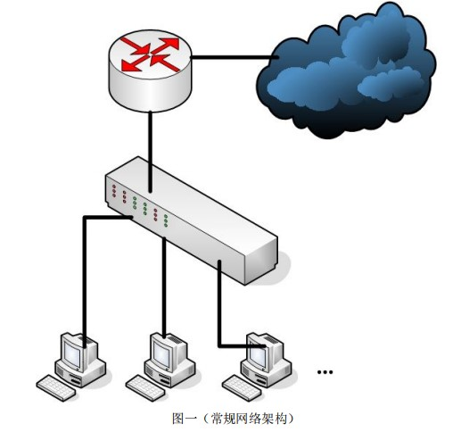
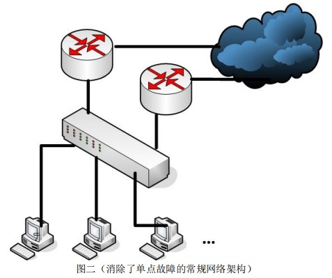

# RFC 3768 VRRP 协议 TODO

> RFC 3768 官方文档：http://www.faqs.org/rfcs/rfc3768.html
>
> 中文版下载：[VRRP-RFC-3768-cn.pdf](https://github.com/hello-world-example/Keepalived/raw/master/docs/RFC-3768/VRRP-RFC-3768-cn.pdf)


## 1 VRRP 产生背景及应用环境

### 1.1 为什么要用 VRRP

VRRP（Virtual Router Redundancy Protocol）—— 虚拟路由器冗余协议，其最新技术标准是 RFC3768。为什么要用 VRRP 呢，主要是为了实现数据链路层互通设备的冗余备份功能，我们来看图一：



常规的局域网一般都是多个终端接到交换机上，然后通过单独的出口路由器连接到 Internet，这时候问题来了，如果这个出口路由器坏掉了，那么整个上行的流量就会全部断掉，这就是传说中的单点故障。

所以说我们要避免出现这种情况，本着冗余备份的思想，我们对上面的网络进行物理改造，如下图： 



现在，这个网络一共有两个 Internet 出口，这样任何一个出口路由器出现故障都不会导致终端用户的上行流量断掉。 

**另外一个问题出现了，我们怎么让终端 PC 知道局域网中有两个出口路由器，并在其中一个出现故障后自动选择另外一个呢？**

可采用的方案包括让终端PC运行动态路由协议，比如 `RIP`、`OSPF`，或者 `ICMP router Discovery client（DISC）`，或者指定一条静态缺省路由。 

但是这三种实现方法都有其劣势及不可行之处，我们来具体分析一下。首先对于在每一个终端 PC 上运行动态路由协议来讲，几乎是不可能的，这其中牵涉到网管的技术能力和日常维护、安全性问题、以及某些终端平台不支持动态路由协议，比如我们常用的 XP、Windows7 都不支持，而 Windows Server 系列 OS 支持。 

假定我们在终端 PC 上部署了动态路由协议，那么每一个终端用户都会遇到下面这种情况： 

> 10086：尊敬的用户您好，申报 RIP 故障请按 1，申报 OSPF 故障请按 2，申报 ISIS 故障请按 3………. 
>
> 用户：( ⊙ o ⊙ )啊！我家是 OSPF，按 2。RFC 3768 VRRP 
>
> 10086：您好，您申报的故障是 OSPF，请进一步选择，OSPF 邻居无法建立请按1，OSPF 密钥不对请按 2，链路状态数据库异常请按 3，路由表错误请按4………….. 
>
> 用户：( ⊙ o ⊙ )啊！……………然后吐血身亡…………. 

所以说，N 多现实问题和困难导致在终端 PC 上部署动态路由协议具有不可行性。 

那么对于在终端 PC 上部署 DISC 等邻居或路由器发现协议呢？也存在种种问题，例如在网络内存在大量主机，每一台都需要运行 DISC，除了增加主机的处理负担外，也会导致协议收敛缓慢，从而不能及时发现不可用邻居路由器，产生路由黑洞，这是不可接受的。 

现在只剩下在终端 PC 上配置静态缺省路由了（**其具体表现形式一般是设置网关**），这是几乎每一个 IP 平台都支持的配置功能，即使是一部 IP 电话机，根据这个思路，我们在终端上配置多个默认网关即可实现路由备份了，但是存在以下两个问题： 

1. 对于下行设备是 PC 来讲，配置了多个默认网关之后，其中一个会作为活动默认网关，其它的作为备份默认网关，其按照下列过程执行流量转发和失效网关检测：

   当 TCP/IP 在通过活动默认网关向某个目标 IP 地址进行 TCP 通信时，如果失败的尝试次数达到 TcpMaxDataRetransmissions 注册表值(默认为 5)的一半(即 3 次)还没有收到响应，TCP/IP 将到达该目标 IP 地址的通信改为使用列表中的下一默认网关，这一步是通过更改该远程 IP 地址的路由缓存项（Route Cache Entry，RCE）来实现的，从而使用列表中的下一个默认网关来作为下一跳地址。其中RCE 是路由表中的一个条目，用于存储目的地的下一跳 IP 地址。当超过 25%的TCP 连接转向下一默认网关时，TCP/IP 将活动默认网关修改为这些连接当前使用的默认网关。 

   如果此时原始默认网关从故障中回复，TCP/IP 将继续使用当前的活动默认网关，而不会转移到原始默认网关，除非重启计算机。如果当前的活动默认网关也出现故障，那么 TCP/IP 就会继续尝试使用列表中的下一个默认网关，在尝试完整个列表后将返回到列表的开始，又从第一个默认网关开始进行尝试。 

   死网关检测仅监视 TCP 流量，如果其他类型的流量连接失败，不会切换默认网关。另外 TCP 是端到端的协议，因此即使当前默认网关完全正常，本地计算机的 TCP 通信失败也可能会导致切换默认网关。当不同网络接口所连接的网络之间没有连接性时(如一个网络接口连接到 Internet，而一个网络接口连接到内部网络)，如果在多个网络接口上同时配置默认网关，在活动默认网关出现故障导致切换默认网关时，就可能会引起连接性故障。比如活动默认网关为 Internet 连接，当它出现问题时，此时默认网关切换为内部连接，此时，本地计算机将无法再访问位于 Internet 连接上的主机。对于这种情况，微软建议使用 route add 来添加对应目的网络的匹配路由，而不是设置多个默认网关，这其实就是最长匹配原则，精确路由优先于缺省路由。 

2. 对于下行设备是路由器的情况，其不会切换默认路由，只会按照配置好的缺省路由优先级进行流量转发，从而导致路由黑洞。

3.RFC 3768 VRRP 结合上面两个原因，在网络出口路由器的下行设备上配置缺省路由的方法也不可行。 


综上所述，要想消除单点故障，又同时实现下行设备在故障发生时的流量无障碍转发，以上的三个方法均不可行，所以人们开发出了一种全新的协议：VRRP， 这种协议无需下行设备与出口路由器进行交互性操作，却完全实现了网络出口的冗余备份，下一节，我们就来详细讨论下 VRRP 的基本原理及实现过程。 

## 2 VRRP 基本原理及实现过程

### 2.1 VRRP 基本概念 

- **VRRP 路由器**：运行 VRRP 协议一个或多个实例的路由器
- **虚拟路由器**：由一个 Master 路由器和多个 Backup 路由器组成。其中，无论 Master 路由器还是 Backup 路由器都是一台 VRRP 路由器，下行设备将虚拟路由器当做默认网关。
- **VRID**：虚拟路由器标识，在**同一个 VRRP 组内的路由器必须有相同的 VRID**，其实 VRID 就相当于一个公司的名称，每个员工介绍自己时都要包含公司名称，表明自己是公司的一员，同样的道理，VRID 表明了这个路由器属于这个 VRRP 组。
- **Master 路由器**：虚拟路由器中承担流量转发任务的路由器
- **Backup 路由器**：当一个虚拟路由器中的 Master 路由器出现故障时，能够代替Master 路由器工作的路由器
- **虚拟 IP 地址**：虚拟路由器的 IP 地址，一个虚拟路由器可以拥有一个或多个虚拟IP 地址。
- **IP 地址拥有者**：接口 IP 和虚拟路由器 IP 地址相同的路由器就叫做 IP 地址拥有者。
- **主 IP 地址**：从物理接口设置的 IP 地址中选择，一个选择规则是总是选用第一个IP 地址，VRRP 通告报文总是用主 IP 地址作为该报文 IP 包头的源 IP。
- **虚拟 MAC 地址**：组成方式是 00-00-5E-00-01-{VRID}，前三个字节 **00-00-5E 是 IANA 组织分配的**，接下来的两个字节 **00-01 是为 VRRP 协议指定的**，最后的 VRID 是虚拟路由器标识，取值范围`[1，255]`

### 2.2 VRRP 报文组成

下面我们来看 VRRP 报文的具体组成：

```

    0                   1                   2                   3
    0 1 2 3 4 5 6 7 8 9 0 1 2 3 4 5 6 7 8 9 0 1 2 3 4 5 6 7 8 9 0 1
   +-+-+-+-+-+-+-+-+-+-+-+-+-+-+-+-+-+-+-+-+-+-+-+-+-+-+-+-+-+-+-+-+
   |Version| Type  | Virtual Rtr ID|   Priority    | Count IP Addrs|
   +-+-+-+-+-+-+-+-+-+-+-+-+-+-+-+-+-+-+-+-+-+-+-+-+-+-+-+-+-+-+-+-+
   |   Auth Type   |   Adver Int   |          Checksum             |
   +-+-+-+-+-+-+-+-+-+-+-+-+-+-+-+-+-+-+-+-+-+-+-+-+-+-+-+-+-+-+-+-+
   |                         IP Address (1)                        |
   +-+-+-+-+-+-+-+-+-+-+-+-+-+-+-+-+-+-+-+-+-+-+-+-+-+-+-+-+-+-+-+-+
   |                            .                                  |
   |                            .                                  |
   |                            .                                  |
   +-+-+-+-+-+-+-+-+-+-+-+-+-+-+-+-+-+-+-+-+-+-+-+-+-+-+-+-+-+-+-+-+
   |                         IP Address (n)                        |
   +-+-+-+-+-+-+-+-+-+-+-+-+-+-+-+-+-+-+-+-+-+-+-+-+-+-+-+-+-+-+-+-+
   |                     Authentication Data (1)                   |
   +-+-+-+-+-+-+-+-+-+-+-+-+-+-+-+-+-+-+-+-+-+-+-+-+-+-+-+-+-+-+-+-+
   |                     Authentication Data (2)                   |
   +-+-+-+-+-+-+-+-+-+-+-+-+-+-+-+-+-+-+-+-+-+-+-+-+-+-+-+-+-+-+-+-+

```

具体字段含义：

- Version：VRRP 协议版本号，RFC3768 定义了版本 2.
- Type：该字段指明了 VRRP 报文的类型，RFC3768 只定义了一种 VRRP 报文，那就是 VRRP 通告报文，所以该字段总是置为 1，若收到的 VRRP 通告报文拥有非 1 的类型值，那么会被丢弃。
- Virtual Rtr ID：也就是我们上面介绍过的 VRID，一个 VRID 唯一地标识了一个虚拟路由器，取值范围是[1,255]，所以一台路由器的接口可以同时运行最多 255 个 VRRP 实例，此字段没有缺省值，必须人为设定。
- Priority：优先级，在一个虚拟路由器中用来选取 Master 路由器和 Backup 路由器，值越大表明优先级越高，此字段共有 8 个 bit，取值范围[1,254]，若没有人为指定，缺省值是 100。其中，VRRP 协议会将 IP 地址拥有者路由器的该字段永远设置为 255，若人为指定为其它值，也不会影响 VRRP 协议的默认行为，即 IP 地址拥有者路由器的该字段总是 255。另外，此字段设置为 0 会出现在下面这种情形中，当 Master 路由器出现故障后，它会立刻发送一个 Priority 置 0 的 VRRP 通告报文，当 Backup 路由器收到此通告报文后，会等待 Skew time 时间，然后将自己切换为 Master 路由器，其中 Skew time=(256-Backup 路由器的优先级)/256，单位为秒，例如若 Backup 路由器的优先级为 100，那么 Skew time=156/256=0.609 秒，对于主路由器来说，Skew time 并没有实际意义，虽然 cisco 的路由器也会计算并显示出来。
- Count IP Addrs：VRRP 通告报文中包含的 IP 地址数量，这个字段其实就是为一个 VRRP 虚拟路由器所分配的 IP 地址的数量。

TODO